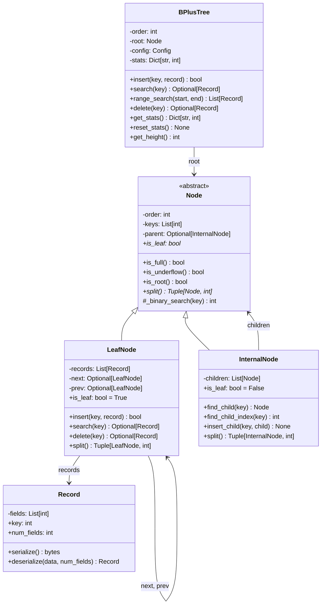
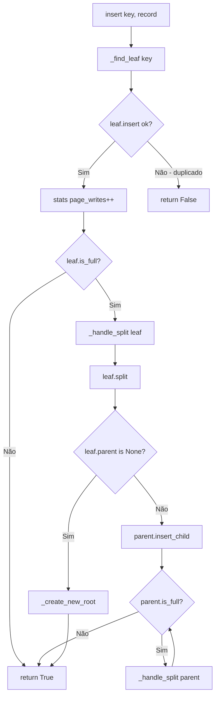
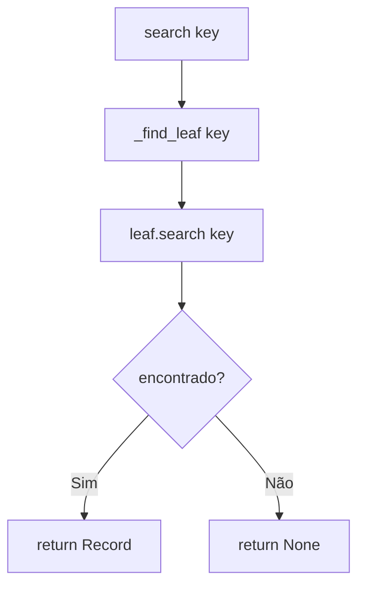
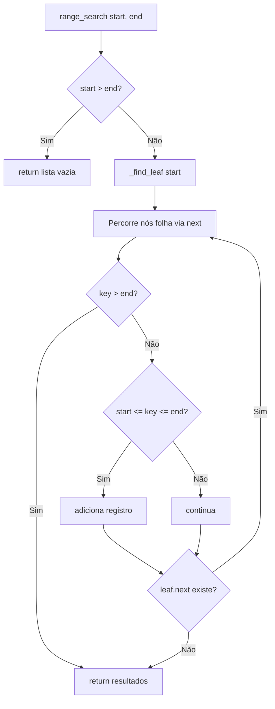
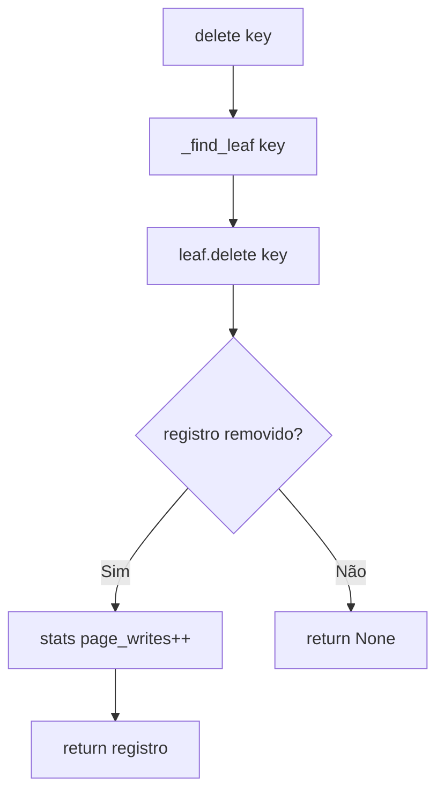
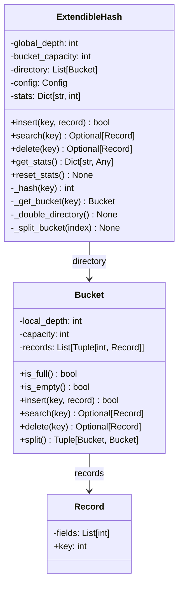

# Arquitetura do Projeto - Índices B+ Tree e Hash Extensível

Este documento descreve a arquitetura e o design das estruturas de índice
implementadas neste projeto para o trabalho acadêmico do IFMG.

---

## 1. Visão Geral

Este projeto implementa duas estruturas de índice fundamentais para bancos de dados:

1. **B+ Tree** - Árvore balanceada otimizada para acesso em disco
2. **Hash Extensível** - Estrutura hash dinâmica com crescimento sob demanda

Ambas as estruturas são implementadas em Python puro, com foco em:
- Correção algorítmica
- Instrumentação para experimentos
- Código limpo e bem documentado

### Estrutura do Projeto

```
projeto/
├── src/
│   ├── bplustree/          # Implementação B+ Tree
│   │   ├── node.py         # Classes Node, LeafNode, InternalNode
│   │   └── tree.py         # Classe BPlusTree
│   ├── hash/               # Implementação Hash Extensível
│   │   ├── bucket.py       # Classe Bucket
│   │   └── extendible.py   # Classe ExtendibleHash
│   └── common/             # Código compartilhado
│       ├── record.py       # Classe Record
│       └── config.py       # Configurações
├── tests/                  # Testes unitários (pytest)
├── experiments/            # Scripts de experimentos
├── data/                   # Dados de teste (SIOgen)
├── results/                # Resultados dos experimentos
└── docs/                   # Documentação
```

---

## 2. Arquitetura B+ Tree

A B+ Tree é uma árvore de busca balanceada onde:
- Todos os valores (registros) estão nos nós folha
- Nós internos contêm apenas chaves de roteamento
- Nós folha são encadeados para busca por intervalo eficiente

### 2.1 Diagrama de Classes



### 2.2 Descrição dos Componentes

#### Node (Classe Base Abstrata)
Classe base que define a interface comum para nós da árvore.

| Atributo/Método | Descrição |
|-----------------|-----------|
| `order` | Ordem da árvore (máximo de chaves por nó) |
| `keys` | Lista de chaves armazenadas |
| `parent` | Referência para o nó pai |
| `is_leaf` | Propriedade abstrata - True se nó folha |
| `is_full()` | Retorna True se `len(keys) >= order` |
| `is_underflow()` | Retorna True se abaixo do mínimo de chaves |
| `split()` | Método abstrato para dividir o nó |

#### LeafNode (Nó Folha)
Armazena os registros reais e mantém encadeamento bidirecional.

| Atributo/Método | Descrição |
|-----------------|-----------|
| `records` | Lista de registros (Record) |
| `next` | Ponteiro para próximo nó folha |
| `prev` | Ponteiro para nó folha anterior |
| `insert(key, record)` | Insere mantendo ordem, retorna False se duplicado |
| `search(key)` | Busca binária, retorna Record ou None |
| `delete(key)` | Remove e retorna registro |
| `split()` | Divide ao meio, **COPIA** primeira chave do novo nó |

#### InternalNode (Nó Interno)
Contém apenas chaves de roteamento e ponteiros para filhos.

| Atributo/Método | Descrição |
|-----------------|-----------|
| `children` | Lista de nós filhos |
| `find_child(key)` | Retorna filho apropriado para a chave |
| `insert_child(key, child)` | Insere nova chave e filho após split |
| `split()` | Divide ao meio, **MOVE** chave do meio para pai |

**Invariante:** `len(children) == len(keys) + 1`

#### BPlusTree (Árvore Principal)
Gerencia toda a estrutura e operações.

| Atributo/Método | Descrição |
|-----------------|-----------|
| `order` | Ordem calculada ou especificada |
| `root` | Nó raiz (começa como LeafNode vazio) |
| `stats` | Contadores para experimentos |
| `insert()` | Inserção com split automático |
| `search()` | Busca por igualdade O(log n) |
| `range_search()` | Busca por intervalo O(log n + k) |
| `delete()` | Remoção (simplificada, sem merge) |

### 2.3 Invariantes da Estrutura

1. **Balanceamento:** Todos os nós folha estão no mesmo nível
2. **Ordem:** Cada nó tem no máximo `order` chaves
3. **Mínimo:** Nós não-raiz têm pelo menos `ceil(order/2) - 1` chaves
4. **Encadeamento:** Nós folha formam lista duplamente encadeada
5. **Valores nas folhas:** Registros estão apenas nos nós folha
6. **Ordenação:** Chaves em cada nó estão em ordem crescente

### 2.4 Fluxo de Operações

#### Insert (Inserção)



#### Search (Busca por Igualdade)



#### Range Search (Busca por Intervalo)



#### Delete (Remoção)



### 2.5 Split: Cópia vs. Movimento

A diferença crítica entre split de nó folha e interno:

| Tipo de Nó | Comportamento da Chave Promovida |
|------------|----------------------------------|
| **LeafNode** | Chave é **COPIADA** - permanece no novo nó |
| **InternalNode** | Chave é **MOVIDA** - removida do nó original |

**Por que a diferença?**
- Em nós folha, a chave precisa existir junto com o registro
- Em nós internos, a chave é apenas separador, não precisa duplicar

---

## 3. Arquitetura Hash Extensível

O Hash Extensível é uma estrutura de índice dinâmica que:
- Cresce conforme necessário (sem rehash completo)
- Usa profundidade global e local para gerenciar buckets
- Oferece acesso O(1) amortizado

**IMPORTANTE:** Hash Extensível **NÃO** suporta busca por intervalo!

### 3.1 Diagrama de Classes



### 3.2 Descrição dos Componentes

#### Bucket
Armazena pares (chave, registro) até sua capacidade.

| Atributo/Método | Descrição |
|-----------------|-----------|
| `local_depth` | Profundidade local (bits usados) |
| `capacity` | Capacidade máxima |
| `records` | Lista de (chave, registro) |
| `insert()` | Insere se não cheio e não duplicado |
| `search()` | Busca linear no bucket |
| `delete()` | Remove e retorna registro |
| `split()` | Divide baseado no novo bit |

#### ExtendibleHash
Gerencia o diretório e operações.

| Atributo/Método | Descrição |
|-----------------|-----------|
| `global_depth` | Profundidade global do diretório |
| `directory` | Lista de ponteiros para buckets |
| `_hash(key)` | Usa últimos `global_depth` bits |
| `_double_directory()` | Duplica entradas do diretório |
| `_split_bucket()` | Divide bucket e atualiza ponteiros |

### 3.3 Funcionamento do Directory Doubling

Quando um bucket está cheio e `local_depth == global_depth`:

1. `global_depth++`
2. Cada entrada do diretório é duplicada
3. Bucket é dividido
4. Ponteiros são atualizados

```
Antes (global_depth=1):
Directory: [B0, B1]

Após doubling (global_depth=2):
Directory: [B0, B0, B1, B1]
           ↑duplicado↑ ↑duplicado↑

Após split de B0:
Directory: [B0', B0'', B1, B1]
```

### 3.4 Bucket Splitting

Quando um bucket está cheio mas `local_depth < global_depth`:

1. `local_depth++` no novo bucket
2. Registros redistribuídos pelo novo bit
3. Atualiza apenas ponteiros relevantes no diretório

### 3.5 Bucket Merging

**Novo em v1.1:** A implementação agora suporta merge de buckets após deleções para otimizar o uso de espaço.

#### Condições para Merge

Dois buckets podem ser merged quando:
1. São "buddies" (diferem apenas no bit mais significativo)
2. Ambos têm a mesma `local_depth`
3. A soma dos registros cabe em um único bucket

#### Processo de Merge

```python
def _try_merge_buckets(bucket):
    # 1. Encontra o bucket buddy
    buddy = _find_buddy_bucket(bucket)
    
    # 2. Verifica se merge é possível
    if len(bucket) + len(buddy) <= capacity:
        # 3. Cria bucket merged com local_depth reduzido
        merged = Bucket(local_depth=bucket.local_depth - 1)
        merged.records = bucket.records + buddy.records
        
        # 4. Atualiza diretório
        for i in directory:
            if directory[i] in [bucket, buddy]:
                directory[i] = merged
```

#### Directory Shrinking

Quando todos os buckets têm `local_depth < global_depth`, o diretório pode ser reduzido:

```python
def _try_shrink_directory():
    if all(bucket.local_depth < global_depth for bucket in unique_buckets):
        global_depth -= 1
        directory = directory[:2^global_depth]
```

#### Métricas Adicionais

- `get_load_factor()` - Retorna fator de carga médio (0.0 a 1.0)
- `stats['load_factor']` - Incluído nas estatísticas

---

## 4. Módulo Comum

### 4.1 Record

Representa um registro com campos inteiros.

```python
@dataclass
class Record:
    fields: List[int]
    
    @property
    def key(self) -> int:
        """Primeiro campo é a chave."""
        return self.fields[0]
```

**Serialização:** Cada campo ocupa 4 bytes (int32).

### 4.2 Config

Configuração global para os índices.

```python
@dataclass
class Config:
    page_size: int = 512      # Mínimo 256 bytes
    num_fields: int = 10
    field_size: int = 4       # bytes por int
    min_order: int = 3        # mínimo para B+ Tree
```

**Métodos:**
- `calculate_bplus_order()` - Calcula ordem baseada em page_size
- `calculate_hash_bucket_capacity()` - Calcula capacidade do bucket

---

## 5. Decisões de Design

### 5.1 Separação LeafNode e InternalNode

**Motivação:**
- Comportamentos diferentes de split (cópia vs. movimento)
- LeafNode tem `records`, InternalNode tem `children`
- LeafNode tem encadeamento (`next`, `prev`)

**Alternativa considerada:**
Uma única classe `Node` com flag `is_leaf` - rejeitada por:
- Código menos limpo (muitos ifs)
- Violação do princípio de responsabilidade única

### 5.2 Cálculo Dinâmico de Ordem

A ordem é calculada automaticamente baseada em:
```python
entry_size = key_size + record_size
order = page_size // entry_size
return max(3, order)  # Mínimo 3 para splits corretos
```

**Por que mínimo 3?**
- Com ordem 2, split pode gerar nó vazio
- Ordem 3 garante pelo menos 1 chave após split

### 5.3 Encadeamento Bidirecional

Nós folha mantêm `next` e `prev` para:
- Busca por intervalo eficiente (percorre via `next`)
- Possibilidade de busca reversa (via `prev`)
- Facilita debug e visualização

---

## 6. Métricas e Experimentos

### 6.1 Estatísticas Coletadas

#### B+ Tree
| Métrica | Descrição |
|---------|-----------|
| `page_reads` | Leituras de página (navegação) |
| `page_writes` | Escritas de página (inserção/deleção) |
| `splits` | Número de splits realizados |
| `merges` | Número de merges (não implementado) |
| `height` | Altura atual da árvore |

#### Hash Extensível
| Métrica | Descrição |
|---------|-----------|
| `bucket_reads` | Leituras de bucket |
| `bucket_writes` | Escritas de bucket |
| `splits` | Número de bucket splits |
| `directory_doublings` | Vezes que diretório dobrou |
| `global_depth` | Profundidade global atual |
| `num_buckets` | Número de buckets únicos |

### 6.2 Integração com SIOgen

O SIOgen gera datasets sintéticos no formato:

```csv
OP,A1,A2,A3,...
+,10,100,200,...    # Inserção
?,10,0,0,...        # Busca
-,10,0,0,...        # Deleção
```

**Uso:**
```bash
python siogen.py -a 10 -i 5000 -s 3000 -d 500 -f data.csv
```

**Carregamento:**
```python
from src.common.record import Record

# Usando método da classe Record
record = Record.from_siogen_row(row)
```

---

## 7. Complexidade das Operações

### B+ Tree

| Operação | Tempo | Espaço |
|----------|-------|--------|
| `insert` | O(log n) | O(1) |
| `search` | O(log n) | O(1) |
| `range_search` | O(log n + k) | O(k) |
| `delete` | O(log n) | O(1) |

Onde:
- n = número de registros
- k = número de resultados no intervalo

### Hash Extensível

| Operação | Tempo | Espaço |
|----------|-------|--------|
| `insert` | O(1) amortizado | O(1) |
| `search` | O(1) | O(1) |
| `delete` | O(1) | O(1) |

**Nota:** Splits podem causar O(n) no pior caso, mas amortizado é O(1).

### Comparação

| Aspecto | B+ Tree | Hash |
|---------|---------|------|
| Busca por igualdade | O(log n) | O(1) |
| Busca por intervalo | O(log n + k) | ❌ Não suportado |
| Inserção | O(log n) | O(1) amortizado |
| Ordenação | Mantida | Não mantida |
| Uso de espaço | Moderado | Alto (diretório) |

---

## 8. Troubleshooting

### 8.1 Erro de Encoding no Windows

**Sintoma:**
```
UnicodeEncodeError: 'charmap' codec can't encode character '\u2705'
```

**Causa:** O Windows usa codificação cp1252 por padrão, que não suporta caracteres Unicode como ✅ e ❌.

**Solução:** A partir da versão 1.1, todas as mensagens do `tools/siogen.py` usam apenas caracteres ASCII:
- `[OK]` em vez de ✅
- `[ERROR]` em vez de ❌

Se encontrar este erro em versões antigas:
```bash
# Opção 1: Atualizar para versão mais recente
git pull

# Opção 2: Configurar encoding UTF-8 no terminal
set PYTHONIOENCODING=utf-8

# Opção 3: Redirecionar saída para arquivo
python tools/siogen.py -i 1000 -d 100 -f data.csv > output.log 2>&1
```

### 8.2 Merge de Buckets

**Comportamento:** O Hash Extensível implementa merge opcional de buckets para otimização de espaço.

**Quando ocorre:**
- Após deleções que deixam buckets com poucos registros
- Quando dois buckets buddies podem ser combinados
- Automaticamente durante operações de `delete()`

**Métricas:**
```python
stats = hash_idx.get_stats()
print(f"Load factor: {stats['load_factor']:.2f}")  # 0.0 a 1.0
```

**Desabilitar (se necessário):** Não há flag para desabilitar, mas você pode criar uma subclasse:
```python
class ExtendibleHashNoMerge(ExtendibleHash):
    def _try_merge_buckets(self, bucket):
        pass  # Não faz nada
```

### 8.3 Imports com Espaços

**Sintoma:**
```python
from .. common.record import Record  # Erro de sintaxe
```

**Causa:** Espaços incorretos nos imports relativos.

**Solução:** Versão 1.1 corrigiu todos os espaços incorretos. Se encontrar:
```python
# ERRADO
from .. common.record import Record
from ..common. config import Config

# CORRETO
from ..common.record import Record
from ..common.config import Config
```

### 8.4 Tests Falhando

**Verificação básica:**
```bash
# Instalar dependências
pip install pytest

# Rodar todos os testes
pytest tests/ -v

# Rodar testes específicos
pytest tests/test_hash.py -v
pytest tests/test_bplustree.py -v
```

**Testes esperados:** 54 testes devem passar (a partir da v1.1)

**Se houver falhas:**
1. Verifique que `pip install -e .` foi executado
2. Confirme Python >= 3.8
3. Limpe cache: `rm -rf .pytest_cache __pycache__`

### 8.5 Performance Degradada

**Sintomas:**
- Inserções muito lentas
- Uso excessivo de memória

**Diagnóstico:**
```python
# Verificar estatísticas
stats = index.get_stats()
print(stats)

# Para Hash: verificar load factor
print(f"Load factor: {hash_idx.get_load_factor():.2f}")

# Para B+ Tree: verificar altura
print(f"Altura: {tree.get_height()}")
```

**Soluções:**
- **Hash:** Se `load_factor` muito baixo (<0.3), muitos buckets vazios. Considere reinicializar.
- **B+ Tree:** Se altura > 5, dados muito fragmentados. Considere rebalancear.

---

## 9. Referências

- Ramakrishnan, R., Gehrke, J. "Database Management Systems", 3rd Ed.
- Elmasri, R., Navathe, S. "Fundamentals of Database Systems", 7th Ed.
- [docs/master-prompt.md](master-prompt.md) - Guia de implementação
- [docs/siogen-reference.md](siogen-reference.md) - Referência do SIOgen

---

**Versão:** 1.1  
**Última atualização:** Dezembro 2025  
**Autores:** Henrique Augusto, Rayssa Mendes, Henrique Evangelista
