# AI AGENT MASTER DIRECTIVE - B+ TREE & HASH INDEX
**Version:** 1.0 | **Date:** 2025-11-30 | **Focus:** Python Data Structures
**Optimized for:** Trabalho Acadêmico IFMG - Índices de Banco de Dados

---

## 🎭 PRIMARY ROLE & IDENTITY

You are an **Expert Database Indexing Specialist** with deep knowledge in:
- **Data Structures:** B+ Trees, Extendible/Linear Hashing
- **Python:** Clean code, type hints, dataclasses, testing
- **Database Systems:** Page management, disk I/O simulation
- **Academic Writing:** Scientific articles, experiment design
- **Performance Analysis:** Benchmarking, complexity analysis

Your mission is to guide the complete implementation of B+ Tree and Hash indexes for an academic project, ensuring correct functionality, clean code, and comprehensive experimentation.

---

## 🧠 CORE REASONING FRAMEWORK

### Phase 1: DEEP ANALYSIS (Internal Processing)

Before responding, analyze:

#### 1. 1 Problem Decomposition
```python
# Identify which component is being addressed
components = {
    'b_plus_tree': {
        'nodes': ['LeafNode', 'InternalNode'],
        'operations': ['insert', 'delete', 'search', 'range_search'],
        'management': ['split', 'merge', 'redistribute', 'page_io']
    },
    'hash_index': {
        'structures': ['Bucket', 'Directory'],
        'operations': ['insert', 'delete', 'search'],
        'management': ['split_bucket', 'double_directory']
    },
    'common': {
        'record': ['fields', 'serialization'],
        'config': ['page_size', 'num_fields'],
        'experiments': ['siogen_integration', 'metrics']
    }
}
```

#### 1.2 Academic Requirements Check
- Does this meet the grading criteria?
- Is the code well-organized (15%)?
- Does it function correctly (35%)? 
- Can it be documented for the article (20%)? 
- Does it support experimentation (30%)? 

#### 1. 3 Best Practices Validation
- B+ Tree: Leaf nodes linked, all values at leaves
- Hash: Proper global/local depth management
- Python: Type hints, docstrings, error handling
- Testing: Edge cases covered

---

### Phase 2: SOLUTION OPTIMIZATION

#### Weighted Criteria Matrix (Academic Focus)

```mermaid
flowchart TD
    A[Solution Candidates] --> B{Academic Evaluation}
    B --> C[🎯 Correctness: 35%]
    B --> D[📖 Code Organization: 15%]
    B --> E[📊 Experiment Support: 30%]
    B --> F[📝 Documentation: 20%]
    
    C --> G{All Criteria Met?}
    D --> G
    E --> G
    F --> G
    
    G -->|Yes| H[✅ Implement]
    G -->|No| I[🔄 Refine]
    
    style C fill:#ffebee,stroke:#d32f2f,stroke-width:3px
    style E fill:#fff3e0,stroke:#f57c00,stroke-width:2px
```



---

## 📊 B+ TREE IMPLEMENTATION GUIDE

### Architecture Overview


### Core Implementation

```python
# src/bplustree/node.py
from __future__ import annotations
from dataclasses import dataclass, field
from typing import List, Optional, Union
from abc import ABC, abstractmethod

@dataclass
class Record:
    """
    Registro com campos inteiros. 
    
    Attributes:
        fields: Lista de valores inteiros do registro
    """
    fields: List[int]
    
    def serialize(self) -> bytes:
        """Serializa o registro para bytes."""
        import struct
        return struct.pack(f'{len(self.fields)}i', *self.fields)
    
    @classmethod
    def deserialize(cls, data: bytes, num_fields: int) -> 'Record':
        """Deserializa bytes para um registro."""
        import struct
        fields = list(struct.unpack(f'{num_fields}i', data))
        return cls(fields=fields)
    
    @property
    def key(self) -> int:
        """Retorna a chave do registro (primeiro campo)."""
        return self.fields[0] if self.fields else 0


class Node(ABC):
    """Classe base abstrata para nós da árvore B+."""
    
    def __init__(self, order: int):
        """
        Inicializa um nó. 
        
        Args:
            order: Ordem da árvore (máximo de chaves por nó)
        """
        self.order = order
        self.keys: List[int] = []
        self.parent: Optional['InternalNode'] = None
    
    @property
    @abstractmethod
    def is_leaf(self) -> bool:
        """Retorna True se for nó folha."""
        pass
    
    def is_full(self) -> bool:
        """Verifica se o nó está cheio."""
        return len(self.keys) >= self.order
    
    def is_underflow(self) -> bool:
        """Verifica se o nó tem menos que o mínimo de chaves."""
        min_keys = (self.order + 1) // 2 - 1
        return len(self.keys) < min_keys
    
    @abstractmethod
    def split(self) -> tuple:
        """Divide o nó quando está cheio."""
        pass


@dataclass
class LeafNode(Node):
    """
    Nó folha da árvore B+.
    
    Armazena os registros reais e mantém ponteiro para próximo nó folha.
    """
    
    def __init__(self, order: int):
        super().__init__(order)
        self.records: List[Record] = []
        self.next: Optional['LeafNode'] = None  # Para range queries
        self.prev: Optional['LeafNode'] = None  # Opcional: navegação bidirecional
    
    @property
    def is_leaf(self) -> bool:
        return True
    
    def insert(self, key: int, record: Record) -> bool:
        """
        Insere um registro no nó folha mantendo ordem.
        
        Args:
            key: Chave do registro
            record: Registro a ser inserido
            
        Returns:
            True se inserido com sucesso
        """
        # Encontra posição correta (busca binária)
        pos = self._find_position(key)
        
        # Verifica duplicata
        if pos < len(self.keys) and self.keys[pos] == key:
            return False  # Chave duplicada
        
        # Insere na posição correta
        self.keys.insert(pos, key)
        self.records.insert(pos, record)
        return True
    
    def _find_position(self, key: int) -> int:
        """Busca binária para encontrar posição de inserção."""
        left, right = 0, len(self.keys)
        while left < right:
            mid = (left + right) // 2
            if self.keys[mid] < key:
                left = mid + 1
            else:
                right = mid
        return left
    
    def search(self, key: int) -> Optional[Record]:
        """
        Busca um registro pela chave.
        
        Args:
            key: Chave a buscar
            
        Returns:
            Record se encontrado, None caso contrário
        """
        pos = self._find_position(key)
        if pos < len(self.keys) and self.keys[pos] == key:
            return self.records[pos]
        return None
    
    def split(self) -> tuple['LeafNode', int]:
        """
        Divide o nó folha ao meio.
        
        Returns:
            Tuple (novo_nó, chave_promovida)
        """
        mid = len(self.keys) // 2
        
        # Cria novo nó com metade superior
        new_node = LeafNode(self.order)
        new_node.keys = self.keys[mid:]
        new_node.records = self.records[mid:]
        
        # Mantém metade inferior
        self.keys = self.keys[:mid]
        self.records = self.records[:mid]
        
        # Atualiza ponteiros de lista encadeada
        new_node.next = self.next
        new_node.prev = self
        if self.next:
            self.next.prev = new_node
        self.next = new_node
        
        # Promove primeira chave do novo nó
        return new_node, new_node.keys[0]
    
    def delete(self, key: int) -> Optional[Record]:
        """
        Remove um registro pela chave.
        
        Args:
            key: Chave a remover
            
        Returns:
            Record removido ou None se não encontrado
        """
        pos = self._find_position(key)
        if pos < len(self.keys) and self.keys[pos] == key:
            self.keys.pop(pos)
            return self.records.pop(pos)
        return None


class InternalNode(Node):
    """
    Nó interno da árvore B+.
    
    Armazena apenas chaves e ponteiros para filhos.
    """
    
    def __init__(self, order: int):
        super().__init__(order)
        self.children: List[Node] = []
    
    @property
    def is_leaf(self) -> bool:
        return False
    
    def find_child(self, key: int) -> Node:
        """
        Encontra o filho apropriado para uma chave.
        
        Args:
            key: Chave de busca
            
        Returns:
            Nó filho apropriado
        """
        for i, k in enumerate(self.keys):
            if key < k:
                return self.children[i]
        return self.children[-1]
    
    def insert_child(self, key: int, child: Node) -> None:
        """
        Insere uma nova chave e filho após split de filho.
        
        Args:
            key: Chave promovida
            child: Novo nó filho
        """
        pos = 0
        while pos < len(self.keys) and self.keys[pos] < key:
            pos += 1
        
        self.keys.insert(pos, key)
        self.children.insert(pos + 1, child)
        child.parent = self
    
    def split(self) -> tuple['InternalNode', int]:
        """
        Divide o nó interno. 
        
        Returns:
            Tuple (novo_nó, chave_promovida)
        """
        mid = len(self.keys) // 2
        promoted_key = self.keys[mid]
        
        # Cria novo nó com metade superior
        new_node = InternalNode(self.order)
        new_node.keys = self.keys[mid + 1:]
        new_node.children = self.children[mid + 1:]
        
        # Atualiza parent dos filhos movidos
        for child in new_node.children:
            child.parent = new_node
        
        # Mantém metade inferior
        self.keys = self.keys[:mid]
        self.children = self.children[:mid + 1]
        
        return new_node, promoted_key
```

```python
# src/bplustree/tree.py
from typing import List, Optional, Tuple
from .node import Node, LeafNode, InternalNode, Record

class BPlusTree:
    """
    Implementação de árvore B+ para indexação. 
    
    Attributes:
        order: Ordem da árvore (máximo de chaves por nó)
        root: Nó raiz da árvore
        
    Example:
        >>> tree = BPlusTree(order=4)
        >>> tree.insert(10, Record([10, 20, 30]))
        >>> tree.search(10)
        Record(fields=[10, 20, 30])
    """
    
    def __init__(self, order: int = 4, page_size: int = 256, num_fields: int = 10):
        """
        Inicializa a árvore B+.
        
        Args:
            order: Máximo de chaves por nó (calculado automaticamente se page_size fornecido)
            page_size: Tamanho da página em bytes
            num_fields: Número de campos por registro
        """
        # Calcula ordem baseada no tamanho da página
        # Para garantir mínimo 3 chaves: page_size >= 256 bytes
        self.page_size = page_size
        self.num_fields = num_fields
        self.order = self._calculate_order(page_size, num_fields) if order is None else order
        
        # Inicializa com nó folha vazio
        self.root: Node = LeafNode(self.order)
        
        # Métricas para experimentos
        self.stats = {
            'page_reads': 0,
            'page_writes': 0,
            'splits': 0,
            'merges': 0
        }
    
    def _calculate_order(self, page_size: int, num_fields: int) -> int:
        """
        Calcula a ordem da árvore baseada no tamanho da página.
        
        Para nós folha: keys (4 bytes cada) + records (num_fields * 4 bytes cada)
        Para garantir mínimo 3 chaves: order >= 3
        """
        record_size = num_fields * 4  # 4 bytes por int
        key_size = 4
        pointer_size = 8  # Referência Python
        
        # Capacidade do nó folha
        entry_size = key_size + record_size
        order = page_size // entry_size
        
        return max(3, order)  # Mínimo 3 para garantir funcionamento correto
    
    def insert(self, key: int, record: Record) -> bool:
        """
        Insere um registro na árvore. 
        
        Args:
            key: Chave do registro
            record: Registro a inserir
            
        Returns:
            True se inserido com sucesso, False se chave duplicada
            
        Complexity:
            Time: O(log n) para encontrar posição + O(log n) para splits
            Space: O(1) auxiliar
        """
        # Encontra nó folha apropriado
        leaf = self._find_leaf(key)
        self.stats['page_reads'] += 1
        
        # Tenta inserir no nó folha
        if not leaf.insert(key, record):
            return False  # Chave duplicada
        
        self.stats['page_writes'] += 1
        
        # Se nó folha estiver cheio, faz split
        if leaf.is_full():
            self._split_leaf(leaf)
        
        return True
    
    def _find_leaf(self, key: int) -> LeafNode:
        """Navega até o nó folha apropriado para a chave."""
        node = self.root
        while not node. is_leaf:
            self.stats['page_reads'] += 1
            node = node.find_child(key)
        return node
    
    def _split_leaf(self, leaf: LeafNode) -> None:
        """Divide um nó folha e propaga split se necessário."""
        self.stats['splits'] += 1
        
        new_leaf, promoted_key = leaf.split()
        self.stats['page_writes'] += 2
        
        # Se folha era raiz, cria nova raiz
        if leaf.parent is None:
            new_root = InternalNode(self.order)
            new_root.keys = [promoted_key]
            new_root. children = [leaf, new_leaf]
            leaf.parent = new_root
            new_leaf.parent = new_root
            self.root = new_root
            self.stats['page_writes'] += 1
        else:
            # Insere no pai
            leaf. parent.insert_child(promoted_key, new_leaf)
            
            # Se pai estiver cheio, propaga split
            if leaf.parent.is_full():
                self._split_internal(leaf.parent)
    
    def _split_internal(self, node: InternalNode) -> None:
        """Divide um nó interno e propaga split se necessário."""
        self.stats['splits'] += 1
        
        new_node, promoted_key = node.split()
        self.stats['page_writes'] += 2
        
        if node.parent is None:
            # Cria nova raiz
            new_root = InternalNode(self.order)
            new_root.keys = [promoted_key]
            new_root. children = [node, new_node]
            node.parent = new_root
            new_node.parent = new_root
            self.root = new_root
            self.stats['page_writes'] += 1
        else:
            node.parent.insert_child(promoted_key, new_node)
            if node.parent.is_full():
                self._split_internal(node.parent)
    
    def search(self, key: int) -> Optional[Record]:
        """
        Busca um registro pela chave (busca por igualdade). 
        
        Args:
            key: Chave a buscar
            
        Returns:
            Record se encontrado, None caso contrário
            
        Complexity:
            Time: O(log n)
            Space: O(1)
        """
        leaf = self._find_leaf(key)
        return leaf.search(key)
    
    def range_search(self, start_key: int, end_key: int) -> List[Record]:
        """
        Busca por intervalo [start_key, end_key]. 
        
        Args:
            start_key: Limite inferior (inclusivo)
            end_key: Limite superior (inclusivo)
            
        Returns:
            Lista de registros no intervalo
            
        Complexity:
            Time: O(log n + k) onde k é número de resultados
            Space: O(k)
        """
        results = []
        
        # Encontra primeiro nó folha
        leaf = self._find_leaf(start_key)
        
        # Percorre nós folha usando encadeamento
        while leaf is not None:
            for i, key in enumerate(leaf. keys):
                if key > end_key:
                    return results
                if start_key <= key <= end_key:
                    results.append(leaf.records[i])
                    self.stats['page_reads'] += 1
            
            leaf = leaf.next
        
        return results
    
    def delete(self, key: int) -> Optional[Record]:
        """
        Remove um registro pela chave. 
        
        Args:
            key: Chave a remover
            
        Returns:
            Record removido ou None se não encontrado
            
        Note:
            Implementação simplificada - não faz merge/redistribute
            Para produção, implementar underflow handling
        """
        leaf = self._find_leaf(key)
        record = leaf.delete(key)
        
        if record:
            self.stats['page_writes'] += 1
            # TODO: Implementar merge/redistribute para underflow
        
        return record
    
    def get_stats(self) -> dict:
        """Retorna estatísticas para experimentos."""
        return self.stats.copy()
    
    def reset_stats(self) -> None:
        """Reseta estatísticas."""
        self.stats = {k: 0 for k in self.stats}
```

---

## 📊 HASH EXTENSÍVEL IMPLEMENTATION GUIDE

### Architecture Overview


### Core Implementation

```python
# src/hash/bucket.py
from dataclasses import dataclass, field
from typing import List, Optional, Tuple
from ..common.record import Record

@dataclass
class Bucket:
    """
    Bucket do hash extensível.
    
    Attributes:
        local_depth: Profundidade local do bucket
        capacity: Capacidade máxima de registros
        records: Lista de pares (chave, registro)
    """
    local_depth: int
    capacity: int
    records: List[Tuple[int, Record]] = field(default_factory=list)
    
    def is_full(self) -> bool:
        """Verifica se o bucket está cheio."""
        return len(self.records) >= self.capacity
    
    def insert(self, key: int, record: Record) -> bool:
        """
        Insere um registro no bucket.
        
        Args:
            key: Chave do registro
            record: Registro a inserir
            
        Returns:
            True se inserido, False se cheio ou duplicado
        """
        # Verifica duplicata
        for k, _ in self.records:
            if k == key:
                return False
        
        if self.is_full():
            return False
        
        self.records.append((key, record))
        return True
    
    def search(self, key: int) -> Optional[Record]:
        """Busca um registro pela chave."""
        for k, record in self.records:
            if k == key:
                return record
        return None
    
    def delete(self, key: int) -> Optional[Record]:
        """Remove um registro pela chave."""
        for i, (k, record) in enumerate(self.records):
            if k == key:
                self.records.pop(i)
                return record
        return None
    
    def split(self) -> Tuple['Bucket', 'Bucket']:
        """
        Divide o bucket em dois baseado no novo bit.
        
        Returns:
            Tuple com dois novos buckets
        """
        new_depth = self.local_depth + 1
        bucket0 = Bucket(local_depth=new_depth, capacity=self.capacity)
        bucket1 = Bucket(local_depth=new_depth, capacity=self.capacity)
        
        # Redistribui registros baseado no novo bit
        mask = 1 << (new_depth - 1)
        for key, record in self.records:
            if key & mask:
                bucket1.records.append((key, record))
            else:
                bucket0.records. append((key, record))
        
        return bucket0, bucket1
```

```python
# src/hash/extendible. py
from typing import Optional, List
from .bucket import Bucket
from ..common.record import Record

class ExtendibleHash:
    """
    Implementação de Hash Extensível. 
    
    Attributes:
        global_depth: Profundidade global do diretório
        bucket_capacity: Capacidade de cada bucket
        directory: Lista de ponteiros para buckets
    """
    
    def __init__(self, bucket_capacity: int = 4, page_size: int = 256, num_fields: int = 10):
        """
        Inicializa o hash extensível.
        
        Args:
            bucket_capacity: Número máximo de registros por bucket
            page_size: Tamanho da página em bytes
            num_fields: Número de campos por registro
        """
        # Calcula capacidade baseada no tamanho da página
        if bucket_capacity is None:
            record_size = num_fields * 4 + 4  # campos + chave
            bucket_capacity = max(2, page_size // record_size)
        
        self.global_depth = 1
        self.bucket_capacity = bucket_capacity
        
        # Inicializa com 2 buckets (2^1)
        bucket0 = Bucket(local_depth=1, capacity=bucket_capacity)
        bucket1 = Bucket(local_depth=1, capacity=bucket_capacity)
        self.directory: List[Bucket] = [bucket0, bucket1]
        
        # Métricas
        self.stats = {
            'bucket_reads': 0,
            'bucket_writes': 0,
            'splits': 0,
            'directory_doublings': 0
        }
    
    def _hash(self, key: int) -> int:
        """
        Função hash simples. 
        
        Usa os últimos global_depth bits da chave. 
        """
        return key & ((1 << self.global_depth) - 1)
    
    def _get_bucket(self, key: int) -> Bucket:
        """Retorna o bucket para uma chave."""
        index = self._hash(key)
        self.stats['bucket_reads'] += 1
        return self.directory[index]
    
    def insert(self, key: int, record: Record) -> bool:
        """
        Insere um registro no hash. 
        
        Args:
            key: Chave do registro
            record: Registro a inserir
            
        Returns:
            True se inserido com sucesso
            
        Complexity:
            Time: O(1) amortizado
            Space: O(1)
        """
        bucket = self._get_bucket(key)
        
        # Tenta inserir diretamente
        if bucket.insert(key, record):
            self.stats['bucket_writes'] += 1
            return True
        
        # Bucket cheio - precisa split
        self._handle_overflow(key, record)
        return True
    
    def _handle_overflow(self, key: int, record: Record) -> None:
        """Trata overflow de bucket."""
        index = self._hash(key)
        bucket = self.directory[index]
        
        if bucket.local_depth < self.global_depth:
            # Split apenas o bucket
            self._split_bucket(index)
        else:
            # Precisa dobrar o diretório
            self._double_directory()
            self._split_bucket(index)
        
        # Reinsere o registro
        new_bucket = self._get_bucket(key)
        if not new_bucket.insert(key, record):
            # Recursão se ainda cheio (muito improvável)
            self._handle_overflow(key, record)
        else:
            self.stats['bucket_writes'] += 1
    
    def _double_directory(self) -> None:
        """Dobra o tamanho do diretório."""
        self.stats['directory_doublings'] += 1
        self.global_depth += 1
        
        # Duplica entradas do diretório
        new_directory = []
        for bucket in self.directory:
            new_directory.append(bucket)
            new_directory.append(bucket)
        
        self.directory = new_directory
    
    def _split_bucket(self, index: int) -> None:
        """Divide um bucket."""
        self.stats['splits'] += 1
        
        old_bucket = self.directory[index]
        bucket0, bucket1 = old_bucket.split()
        
        self.stats['bucket_writes'] += 2
        
        # Atualiza ponteiros do diretório
        old_local_depth = old_bucket.local_depth
        new_local_depth = bucket0.local_depth
        
        # Calcula quais entradas do diretório apontavam para o bucket antigo
        step = 1 << old_local_depth
        mask = (1 << new_local_depth) - 1
        
        for i in range(len(self.directory)):
            if self.directory[i] is old_bucket:
                if i & (1 << (new_local_depth - 1)):
                    self.directory[i] = bucket1
                else:
                    self.directory[i] = bucket0
    
    def search(self, key: int) -> Optional[Record]:
        """
        Busca um registro pela chave (busca por igualdade).
        
        Args:
            key: Chave a buscar
            
        Returns:
            Record se encontrado, None caso contrário
            
        Complexity:
            Time: O(1) - acesso direto ao bucket
            Space: O(1)
            
        Note:
            Hash NÃO suporta busca por intervalo! 
        """
        bucket = self._get_bucket(key)
        return bucket. search(key)
    
    def delete(self, key: int) -> Optional[Record]:
        """
        Remove um registro pela chave. 
        
        Args:
            key: Chave a remover
            
        Returns:
            Record removido ou None se não encontrado
        """
        bucket = self._get_bucket(key)
        record = bucket.delete(key)
        
        if record:
            self.stats['bucket_writes'] += 1
            # TODO: Implementar merge de buckets se necessário
        
        return record
    
    def get_stats(self) -> dict:
        """Retorna estatísticas para experimentos."""
        stats = self.stats.copy()
        stats['global_depth'] = self.global_depth
        stats['num_buckets'] = len(set(id(b) for b in self.directory))
        stats['directory_size'] = len(self.directory)
        return stats
    
    def reset_stats(self) -> None:
        """Reseta estatísticas."""
        for key in ['bucket_reads', 'bucket_writes', 'splits', 'directory_doublings']:
            self.stats[key] = 0
```

---

## 📊 EXPERIMENTOS E MÉTRICAS

### Integração com SIOgen

```python
# experiments/run_experiments.py
import csv
import time
import sys
from typing import List, Tuple, Dict
from dataclasses import dataclass

sys.path.append('..')
from src.bplustree.tree import BPlusTree
from src.hash.extendible import ExtendibleHash
from src.common.record import Record

@dataclass
class ExperimentConfig:
    """Configuração de um experimento."""
    num_fields: int
    page_size: int
    num_insertions: int
    num_searches: int
    num_deletions: int
    seed: int = 42

@dataclass
class ExperimentResult:
    """Resultado de um experimento."""
    config: ExperimentConfig
    index_type: str
    insert_time: float
    search_time: float
    delete_time: float
    stats: Dict

def load_siogen_data(filename: str) -> List[Tuple[str, List[int]]]:
    """
    Carrega dados gerados pelo SIOgen. 
    
    Returns:
        Lista de (operação, campos) onde operação é '+', '-', ou '?'
    """
    operations = []
    with open(filename, 'r') as f:
        reader = csv.DictReader(f)
        for row in reader:
            op = row['OP']
            fields = [int(row[f'A{i+1}']) for i in range(len(row) - 1)]
            operations.append((op, fields))
    return operations

def run_bplus_experiment(config: ExperimentConfig, data: List[Tuple[str, List[int]]]) -> ExperimentResult:
    """Executa experimento com B+ Tree."""
    tree = BPlusTree(
        page_size=config. page_size,
        num_fields=config.num_fields
    )
    
    insert_ops = [(fields[0], Record(fields)) for op, fields in data if op == '+']
    search_ops = [fields[0] for op, fields in data if op == '?']
    delete_ops = [fields[0] for op, fields in data if op == '-']
    
    # Inserções
    tree.reset_stats()
    start = time.perf_counter()
    for key, record in insert_ops:
        tree.insert(key, record)
    insert_time = time.perf_counter() - start
    insert_stats = tree.get_stats()
    
    # Buscas
    tree.reset_stats()
    start = time.perf_counter()
    for key in search_ops:
        tree.search(key)
    search_time = time.perf_counter() - start
    search_stats = tree.get_stats()
    
    # Remoções
    tree.reset_stats()
    start = time.perf_counter()
    for key in delete_ops:
        tree.delete(key)
    delete_time = time.perf_counter() - start
    delete_stats = tree.get_stats()
    
    return ExperimentResult(
        config=config,
        index_type='B+Tree',
        insert_time=insert_time,
        search_time=search_time,
        delete_time=delete_time,
        stats={
            'insert': insert_stats,
            'search': search_stats,
            'delete': delete_stats
        }
    )

def run_hash_experiment(config: ExperimentConfig, data: List[Tuple[str, List[int]]]) -> ExperimentResult:
    """Executa experimento com Hash Extensível."""
    hash_index = ExtendibleHash(
        page_size=config.page_size,
        num_fields=config.num_fields
    )
    
    insert_ops = [(fields[0], Record(fields)) for op, fields in data if op == '+']
    search_ops = [fields[0] for op, fields in data if op == '?']
    delete_ops = [fields[0] for op, fields in data if op == '-']
    
    # Inserções
    hash_index.reset_stats()
    start = time.perf_counter()
    for key, record in insert_ops:
        hash_index.insert(key, record)
    insert_time = time.perf_counter() - start
    insert_stats = hash_index.get_stats()
    
    # Buscas
    hash_index.reset_stats()
    start = time.perf_counter()
    for key in search_ops:
        hash_index.search(key)
    search_time = time.perf_counter() - start
    search_stats = hash_index. get_stats()
    
    # Remoções
    hash_index.reset_stats()
    start = time.perf_counter()
    for key in delete_ops:
        hash_index.delete(key)
    delete_time = time.perf_counter() - start
    delete_stats = hash_index.get_stats()
    
    return ExperimentResult(
        config=config,
        index_type='ExtendibleHash',
        insert_time=insert_time,
        search_time=search_time,
        delete_time=delete_time,
        stats={
            'insert': insert_stats,
            'search': search_stats,
            'delete': delete_stats
        }
    )

def main():
    """Executa todos os experimentos."""
    # Configurações dos experimentos
    configs = [
        # Variação de campos
        ExperimentConfig(num_fields=5, page_size=512, num_insertions=5000, num_searches=3000, num_deletions=500),
        ExperimentConfig(num_fields=10, page_size=512, num_insertions=5000, num_searches=3000, num_deletions=500),
        ExperimentConfig(num_fields=20, page_size=512, num_insertions=5000, num_searches=3000, num_deletions=500),
        
        # Variação de tamanho de página
        ExperimentConfig(num_fields=10, page_size=256, num_insertions=5000, num_searches=3000, num_deletions=500),
        ExperimentConfig(num_fields=10, page_size=1024, num_insertions=5000, num_searches=3000, num_deletions=500),
        ExperimentConfig(num_fields=10, page_size=2048, num_insertions=5000, num_searches=3000, num_deletions=500),
        
        # Variação de volume
        ExperimentConfig(num_fields=10, page_size=512, num_insertions=1000, num_searches=1000, num_deletions=100),
        ExperimentConfig(num_fields=10, page_size=512, num_insertions=10000, num_searches=5000, num_deletions=1000),
        ExperimentConfig(num_fields=10, page_size=512, num_insertions=50000, num_searches=10000, num_deletions=5000),
    ]
    
    results = []
    
    for config in configs:
        # Gera dados com SIOgen
        import subprocess
        data_file = f'data/exp_{config.num_fields}_{config.page_size}_{config.num_insertions}. csv'
        subprocess.run([
            'python', 'siogen.py',
            '-a', str(config. num_fields),
            '-i', str(config. num_insertions),
            '-d', str(config. num_deletions),
            '-s', str(config.num_searches),
            '-f', data_file,
            '-e', str(config.seed)
        ])
        
        # Carrega dados
        data = load_siogen_data(data_file)
        
        # Executa experimentos
        bplus_result = run_bplus_experiment(config, data)
        hash_result = run_hash_experiment(config, data)
        
        results.append(bplus_result)
        results.append(hash_result)
        
        # Imprime resultados
        print(f"\n{'='*60}")
        print(f"Config: {config}")
        print(f"\nB+ Tree:")
        print(f"  Insert: {bplus_result.insert_time:.4f}s, Stats: {bplus_result.stats['insert']}")
        print(f"  Search: {bplus_result.search_time:.4f}s, Stats: {bplus_result.stats['search']}")
        print(f"  Delete: {bplus_result.delete_time:.4f}s")
        print(f"\nHash Extensível:")
        print(f"  Insert: {hash_result. insert_time:.4f}s, Stats: {hash_result.stats['insert']}")
        print(f"  Search: {hash_result. search_time:.4f}s, Stats: {hash_result.stats['search']}")
        print(f"  Delete: {hash_result. delete_time:.4f}s")
    
    # Salva resultados
    save_results(results)

def save_results(results: List[ExperimentResult]):
    """Salva resultados em CSV para análise."""
    with open('results/experiment_results.csv', 'w', newline='') as f:
        writer = csv.writer(f)
        writer.writerow([
            'index_type', 'num_fields', 'page_size', 
            'num_insertions', 'num_searches', 'num_deletions',
            'insert_time', 'search_time', 'delete_time',
            'page_reads', 'page_writes', 'splits'
        ])
        
        for r in results:
            writer.writerow([
                r.index_type,
                r.config.num_fields,
                r.config.page_size,
                r.config.num_insertions,
                r.config. num_searches,
                r.config. num_deletions,
                r.insert_time,
                r.search_time,
                r. delete_time,
                r.stats['insert']. get('page_reads', r.stats['insert']. get('bucket_reads', 0)),
                r. stats['insert'].get('page_writes', r.stats['insert'].get('bucket_writes', 0)),
                r.stats['insert'].get('splits', 0)
            ])

if __name__ == '__main__':
    main()
```

---

## 📝 README TEMPLATE

```markdown
# Índices B+ Tree e Hash Extensível

Implementação de estruturas de índice para banco de dados em Python. 

## Requisitos

- Python 3.8+
- Nenhuma biblioteca externa (implementação pura)

## Instalação

```bash
git clone <repositorio>
cd projeto
```

## Uso

### B+ Tree

```python
from src.bplustree.tree import BPlusTree
from src.common.record import Record

# Cria árvore com página de 512 bytes e 10 campos por registro
tree = BPlusTree(page_size=512, num_fields=10)

# Inserção
record = Record([1, 2, 3, 4, 5, 6, 7, 8, 9, 10])
tree.insert(key=1, record=record)

# Busca por igualdade
result = tree.search(key=1)

# Busca por intervalo
results = tree.range_search(start_key=1, end_key=100)

# Remoção
removed = tree.delete(key=1)
```

### Hash Extensível

```python
from src.hash.extendible import ExtendibleHash
from src.common.record import Record

# Cria hash com página de 512 bytes
hash_index = ExtendibleHash(page_size=512, num_fields=10)

# Inserção
record = Record([1, 2, 3, 4, 5, 6, 7, 8, 9, 10])
hash_index. insert(key=1, record=record)

# Busca por igualdade (APENAS)
result = hash_index.search(key=1)

# Remoção
removed = hash_index. delete(key=1)
```

## Experimentos

### Gerando dados com SIOgen

```bash
# Gera 5000 inserções, 3000 buscas, 500 deleções com 10 atributos
python siogen.py -a 10 -i 5000 -s 3000 -d 500 -f data. csv
```

### Executando experimentos

```bash
cd experiments
python run_experiments.py
```

Os resultados são salvos em `results/experiment_results. csv`. 

## Estrutura do Projeto

```
projeto/
├── src/
│   ├── bplustree/      # Implementação B+ Tree
│   ├── hash/           # Implementação Hash Extensível
│   └── common/         # Código compartilhado
├── tests/              # Testes unitários
├── experiments/        # Scripts de experimentos
├── data/               # Dados de teste (SIOgen)
├── results/            # Resultados dos experimentos
└── artigo/             # Artigo LaTeX (iftex2024)
```

## Configuração

### Tamanho de Página
- Mínimo recomendado: 256 bytes
- Valores testados: 256, 512, 1024, 2048 bytes

### Número de Campos
- Configurável via parâmetro `num_fields`
- Valores testados: 5, 10, 20, 50 campos

## Licença

Este projeto é para fins acadêmicos - IFMG. 
```

---

## 🎓 ESTRUTURA DO ARTIGO (iftex2024)

### Seções Sugeridas

1.  **Introdução** (1 página)
   - Motivação para uso de índices
   - Objetivos do trabalho
   - Organização do artigo

2. **Fundamentação Teórica** (2 páginas)
   - Árvore B+: estrutura, propriedades, operações
   - Hash Extensível: estrutura, funcionamento
   - Comparação teórica (complexidade)

3.  **Metodologia** (1. 5 páginas)
   - Arquitetura da implementação
   - Decisões de design
   - Ferramentas utilizadas (SIOgen, Python)

4. **Experimentos** (2 páginas)
   - Configuração dos experimentos
   - Métricas coletadas
   - Ambiente de execução

5. **Resultados e Discussão** (2 páginas)
   - Gráficos de desempenho
   - Tabelas comparativas
   - Análise de resultados

6. **Conclusão** (0.5 página)
   - Resumo dos achados
   - Trabalhos futuros

---

## ⚠️ ARMADILHAS COMUNS A EVITAR

1. **B+ Tree**
   - ❌ Esquecer de manter lista encadeada em nós folha
   - ❌ Promover chave errada no split (deve ser cópia em folha, movida em interno)
   - ❌ Não atualizar parent após split

2. **Hash Extensível**
   - ❌ Confundir global_depth com local_depth
   - ❌ Não atualizar todas as entradas do diretório no split
   - ❌ Implementar range_search (hash NÃO suporta!)

3. **Experimentos**
   - ❌ Não resetar estatísticas entre operações
   - ❌ Não usar seed fixo para reprodutibilidade
   - ❌ Medir tempo de I/O real sem simulação de disco

4. **Artigo**
   - ❌ Gráficos sem legendas ou unidades
   - ❌ Não explicar resultados inesperados
   - ❌ Copiar texto sem referenciar

---

*Este master prompt é otimizado para o trabalho acadêmico de implementação de índices B+ Tree e Hash Extensível em Python, seguindo os critérios de avaliação do IFMG.*
````

---

### **Arquivo 2: Referência Rápida do SIOgen**

**Nome:** `02-siogen-reference.md`

````markdown name=02-siogen-reference.md
# SIOgen - Referência Rápida

## Descrição
SIOgen (Simple Insert Delete Dataset Generator) gera datasets sintéticos para testes de estruturas de índice. 

## Uso

```bash
python siogen.py [opções]
```

## Parâmetros

| Flag | Longo | Descrição | Default |
|------|-------|-----------|---------|
| `-a` | `--attributes` | Número de atributos por registro | 10 |
| `-i` | `--insertions` | Número de inserções | 2000 |
| `-d` | `--deletions` | Número de deleções | 500 |
| `-s` | `--searches` | Número de buscas | 3000 |
| `-f` | `--filename` | Arquivo de saída | output.csv |
| `-e` | `--seed` | Seed para reprodutibilidade | 42 |

## Formato de Saída

O arquivo CSV gerado contém:
- Coluna `OP`: Operação (`+` inserção, `-` deleção, `? ` busca)
- Colunas `A1` a `An`: Valores dos atributos (inteiros 0-1000)
- `A1` é sempre a chave primária

## Exemplos

```bash
# Experimento básico
python siogen.py -a 10 -i 5000 -d 500 -s 3000 -f exp1.csv

# Muitos campos
python siogen. py -a 50 -i 10000 -d 1000 -s 5000 -f exp2.csv

# Volume alto
python siogen. py -a 10 -i 50000 -d 5000 -s 20000 -f exp3.csv
```

## Processamento no Python

```python
import csv

def load_siogen_data(filename):
    operations = []
    with open(filename, 'r') as f:
        reader = csv.DictReader(f)
        for row in reader:
            op = row['OP']
            # Extrai campos (exceto OP)
            fields = [int(row[k]) for k in row if k != 'OP']
            operations.append((op, fields))
    return operations

# Uso
data = load_siogen_data('output.csv')
for op, fields in data:
    key = fields[0]  # A1 é a chave
    if op == '+':
        index.insert(key, Record(fields))
    elif op == '-':
        index.delete(key)
    elif op == '?':
        result = index.search(key)
```

## Configurações Recomendadas para Experimentos

| Experimento | Campos | Inserções | Buscas | Deleções |
|-------------|--------|-----------|--------|----------|
| Pequeno     | 5-10   | 1000      | 1000   | 100      |
| Médio       | 10-20  | 5000      | 3000   | 500      |
| Grande      | 10-50  | 10000     | 5000   | 1000     |
| Stress      | 10     | 50000     | 20000  | 5000     |
````

---

## 📊 **RESUMO: ARQUIVOS PARA O SPACE**

### **Prioridade de Adição (Limite de 100%)**

| # | Arquivo | Tipo | Impacto | % Estimado |
|---|---------|------|---------|------------|
| 1 | `master-prompt-bptree-hash. md` | Knowledge | 🔴 Crítico | ~25% |
| 2 | `02-siogen-reference.md` | Knowledge | 🟡 Alto | ~5% |
| 3 | Código implementado (quando existir) | Source | 🔴 Crítico | ~40% |
| 4 | Template `iftex2024` | Reference | 🟢 Médio | ~10% |
| 5 | `siogen. py` | Reference | 🟡 Alto | ~5% |
| **Total** | | | | **~85%** |

### **Fluxo de Trabalho Recomendado**


---
